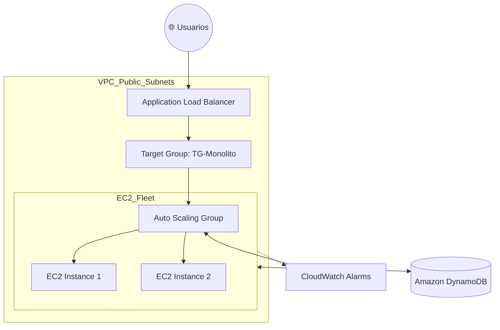

# 🚀 Proyecto: Monolito Escalable en AWS
> **Módulo 6: Escalabilidad, Alta Disponibilidad y Monitoreo**

Este repositorio contiene la documentación y evidencias de la migración de una infraestructura on-premise hacia una arquitectura elástica en **Amazon Web Services**, realizada como parte de la evaluación final del Módulo 6.

---

## 📋 Situación Inicial
La aplicación presentaba fallos de disponibilidad en picos de tráfico. Se implementó una solución basada en el **Manejo de Cómputo Elástico** para eliminar puntos únicos de fallo y optimizar costos.

## 🏗️ Arquitectura del Sistema
La solución utiliza un enfoque de **Infraestructura Viva**, combinando balanceo de carga y auto-escalado.

### 🗺️ Diagrama de Infraestructura

## 🛠️ Stack Tecnológico

| Servicio | Función |
| :--- | :--- |
| **Amazon EC2** | Instancias de cómputo para la aplicación Monolítica (Amazon Linux 2023). |
| **AWS ALB** | Balanceador de Carga de Aplicaciones para distribución en Capa 7. |
| **AWS ASG** | Auto Scaling Group para asegurar alta disponibilidad y elasticidad. |
| **CloudWatch** | Monitoreo de métricas y alarmas de umbral de CPU. |
| **DynamoDB** | Persistencia NoSQL para registro de datos (Opcional). |

---

## 🚀 Implementación y Lecciones Aprendidas

### 1. Despliegue y Seguridad
Se configuró un **Security Group** robusto permitiendo tráfico entrante en los puertos `80` (HTTP), `443` (HTTPS) y `22` (SSH para administración). Se validó la conectividad inicial mediante la IP pública antes de la integración con el balanceador.

### 2. Balanceo y Alta Disponibilidad
La implementación del **Target Group** permitió realizar *Health Checks* automáticos a la ruta raíz (`/`). Durante este proceso, se realizó el troubleshooting de un **Error 503**, identificando la necesidad de sincronizar las reglas de seguridad entre el ALB y las instancias EC2 para permitir el flujo de tráfico.

### 3. Escalado Automático y Monitoreo
Se definió un **Launch Template** con scripts de *User Data* para automatizar el despliegue de nuevas instancias. Se configuró una alarma de **CloudWatch** que monitorea el uso de CPU, garantizando que el sistema escale horizontalmente de forma automática ante picos de demanda.

---

## 👤 Autor
**Jimmy Agüero** *Estudiante Arquitecto Cloud* 

---
